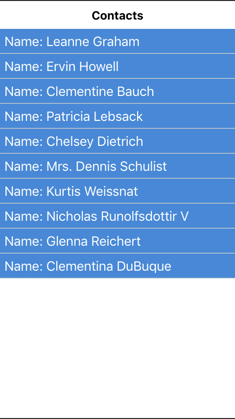

# LIQID Front End test

This app compiles to ios, android and web using React native and React native web.
for this test please choose one of ios or android that you'll want to support - no need for both.
For ios you might need Xcode and for android you might need Android Studio and JDK.
Please contact us with any questions or problems you might incounter.

## Task
- Build a contacts app with a contact list and a detailed contact view
- implement the design in the pictures (or make it better 🤨)

### Contact List page
- The contacts item list data should come from the jsonplaceholder endpoint`https://jsonplaceholder.typicode.com/users`.
- When clicked the user should be shown the detailed contact view page with all the contact's details in the design.
- The contact list should be the default home page
- Each item should show the `name` of the contact.
- On `desktop` the items and the full detailed view should be side by side
- On `ios/android/web-mobile` the list and the full view should show separately with a return/back/close button to return the user to the list

### Detailed contact page
- The page should show the contact's details as per the design

### Bonus Tasks (optional)
- add a form to add new contacts to be added to the current contacts list
- Create tests for all your components and reducers
- add images to each contact
- When clicking on the phone number the user should be redirected to the phone app (to call the number)
- When clicking on the website the user should be redirected (in a new tab) to the website of the contact
- Support both ios and android

#### If you run into problems contact us 📞 :)

## Installation
- install Xcode or android studio and follow the react native instructions [under the "Building Projects with Native Code" tab](http://facebook.github.io/react-native/docs/getting-started.html)
- Install (if you chose to support android) [adb (Android Debug Bridge)](https://developer.android.com/studio/releases/platform-tools.html)

## Running

- Native compiler - `npm run start`
- Web - `npm run web`
- IOS Simulator - `npm run ios`
- Android Simulator - `npm run android`

## Debugging

Open dev menu:
1. CMD+D (IOS) / CMD+M (Android)
2. Press "Enable Live-Reload" and press "Enable remote debugging"

[On real devices](http://facebook.github.io/react-native/releases/0.49/docs/running-on-device.html)
[React native docs](http://facebook.github.io/react-native/docs/debugging.html)
